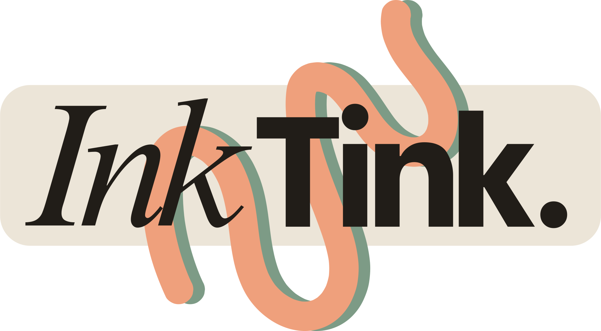

  

# [InkTink](https://sarahmit.github.io/InkTink/)

A creative writing workshop that lives in your browser. No account, no server, no subscription. Your projects stay in your own files.

InkTink is a hobby project I thought about for a long time and could finally realize with the help of Claude.

## Features

- **Writing** — chapters and scenes with a distraction-free editor
- **Story Beats** — structure your plot with beat boards
- **Characters** — character profiles with images
- **Worldbuilding** — entries for places, objects, lore, and custom categories
- **Timeline** — visual scene and event timeline
- **Theme** — capture your story's theme, question, and message
- **Moodboard** — collect images for atmosphere and inspiration
- **Brainstorming** — a freeform canvas for notes and ideas
- **Stats** — word count, writing goals, and progress over time
- **Export** — download your manuscript as a Word document

## Your data & privacy

Project files are saved only in your browser's local storage — nothing is ever sent to a server, and nobody but you can see your writing. To back up or move a project to another device, use the **Export** button to download a `.json` file and **Import** to open it again.

Two things to keep in mind:

- **Your projects live in this browser, on this device.** They are stored unencrypted, like a document file on your disk. Anyone who uses the same computer account and browser could open InkTink and read them.
- **On a shared or public computer** (library, work, a friend's laptop), either use a **private/incognito window** — everything vanishes when you close it — or use **"Delete all data from this browser"** at the bottom of the home page when you're done. That dialog also offers a full backup download (every project plus the idea pool in one file) which **Import** can restore later.

And as with anything that lives in a browser: clearing your browsing data deletes your projects too, so export a backup now and then.

## Offline & mobile

InkTink works as a [Progressive Web App](https://developer.mozilla.org/en-US/docs/Web/Progressive_web_apps). After your first visit it loads without an internet connection. On a phone or tablet you can add it to your home screen for a full-screen, app-like experience.
